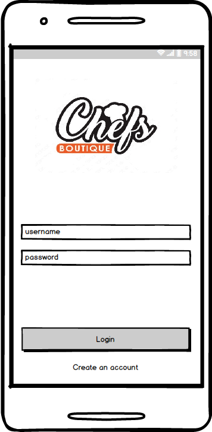
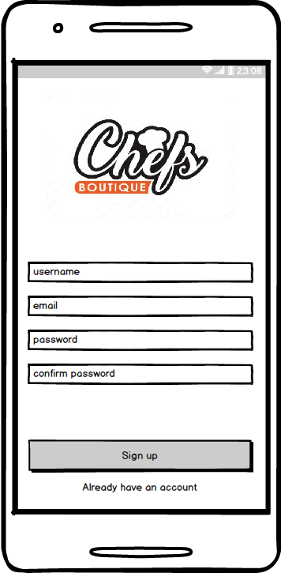
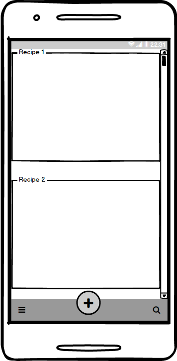
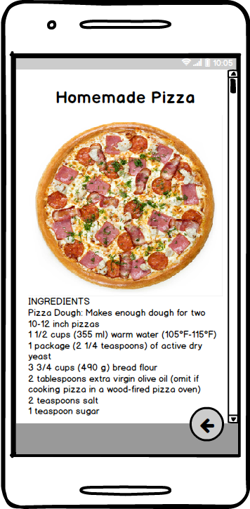
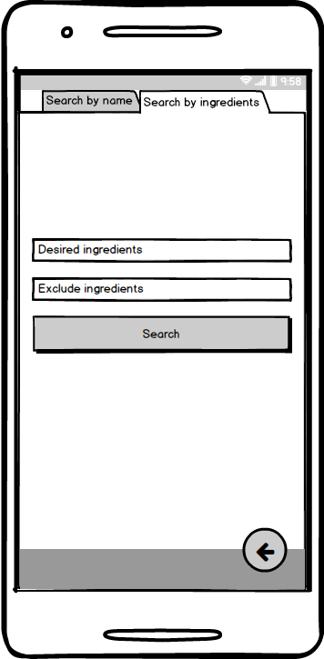
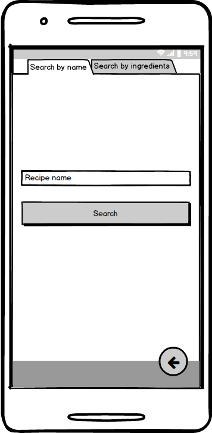
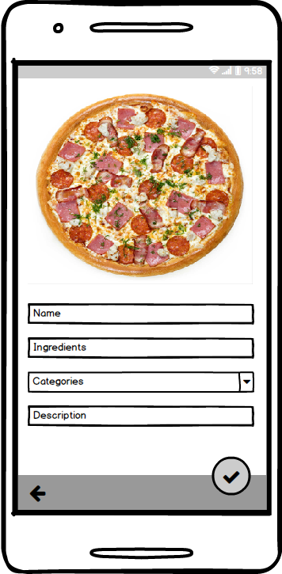

# Project requirements
---

# Content
1 [Introduction](#intro)  
1.1 [Purpose](#appointment)  
1.2 [Business requirements](#business_requirements)  
1.2.1 [Source data](#initial_data)  
1.2.2 [Business opportunities](#business_opportunities)  
1.2.3 [Project boundaries](#project_boundary)  
1.3 [Analogs](#analogues)  
2 [User requirements](#user_requirements)  
2.1 [Software interfaces](#software_interfaces)  
2.2 [User interface](#user_interface)  
2.3 [User specifications](#user_specifications)  
2.3.1 [Application audience](#application_audience)   
2.4 [Assumptions and dependencies](#assumptions_and_dependencies)  
3 [System requirements](#system_requirements)  
3.1 [Functional requirements](#functional_requirements)  
3.1.1 [Main functions](#main_functions)   
3.1.1.1 [User login](#user_login)  
3.1.1.2 [User sign up](#user_sign_up)  
3.1.1.3 [The start page of the application. View saved user recipes](#show_start_page)  
3.1.1.4 [View recipe](#show_recipe)  
3.1.1.5 [Recipe search by ingredients](#search_recipe_by_ingredients)  
3.1.1.6 [Recipe search by name](#search_recipe_by_name)  
3.1.1.7 [Creating a new recipe](#create_recipe)  
3.2 [Non-functional requirements](#non-functional_requirements)  
3.2.1 [Quality attributes](#quality_attributes)  
3.2.1.1 [Ease of use requirements](#requirements_for_ease_of_use)  
3.2.1.2 [Security Requirements](#security_requirements)  
3.2.2 [Restrictions](#restrictions)  

### Glossary
* SQLite — is a compact embedded relational database that supports a fairly complete set of SQL commands and is available in source code (in C). The source code for SQLite is in the public domain, meaning there are no usage restrictions at all.
* Firebase — is a platform for building Android, iOS and mobile web applications. The database allows you to work with data that is stored as JSON, synchronized in real time and available in the absence of the Internet.
* Material Design — is a style of software and application design developed by Google. The surfaces and edges of elements in this direction of design create visual images and signals that transmit hints and help you to orient yourself intuitively, as if it were happening in the real world.
<a name="intro"/>

# 1 Introduction

<a name="appointment"/>

## 1.1 Purpose
This document describes the functional and non-functional requirements for the ChefsBoutique mobile application for the Android operating system.

<a name="business_requirements"/>

## 1.2 Business requirements

<a name="initial_data"/>

### 1.2.1 Source data
Recipe books come in handy for anyone who likes to cook tasty and wholesome food. But the days have gone by when we used recipe books to find that secret recipe. Smartphone applications now play an important role in the kitchen, helping to find different types of recipes and prepare delicious dishes.

<a name="business_opportunities"/>

### 1.2.2 Business opportunities
Many people who want and love to cook, want to have an application that provides access to their account, their favorite recipes, and also allows you to find an interesting recipe. Such an application will allow them to add a new recipe, get quick access to their saved recipes, and also find a new interesting recipe.

<a name="project_boundary"/>

### 1.2.3 Project Boundaries
The ChefsBoutique app allows registered users to create new recipes, access saved ones, and search for new recipes.

<a name="analogues"/>

## 1.3 Analogs
 Functions |[Kitchen Stories](https://play.google.com/store/apps/details?id=com.ajnsnewmedia.kitchenstories)| [MealBoard](http://itunes.apple.com/WebObjects/MZStore.woa/wa/viewSoftware?id=333425918&mt=8) | [SideChef](https://play.google.com/store/apps/details?id=com.sidechef.sidechef) 
--- | :-: | :-: | :-:
Available on Android |+|-|+
Russian language support | +|-|-
Is free |+|-|-
Create your own recipe | -|+|+
Create Shopping List | +|+|+

<a name="user_requirements"/>

# 2 User requirements

<a name="software_interfaces"/>

## 2.1 Software interfaces
Application uses API [Recipe Puppy](http://www.recipepuppy.com/).

<a name="user_interface"/>

## 2.2 User interface  
Login screen.  
  
Sign up screen.  
  
The screen of the main window.  
  
Recipe Screen.  
  
Recipe search screen by ingredients.  
  
Recipe search screen by name.  

Recipe creation screen.  

<a name="user_specifications"/>

## 2.3 User specifications

<a name="user_classes"/>

### 2.3.1 Application Audience

People who want to change their culinary life and add variety to their usual diet.
<a name="assumptions_and_dependencies"/>

## 2.4 Assumptions and Dependencies
1. The search for new recipes does not work in the absence of an Internet connection.

<a name="system_requirements"/>

# 3 System Requirements

<a name="functional_requirements"/>

## 3.1 Functional Requirements

<a name="main_functions"/>

### 3.1.1 Main functions

<a name="user_login"/>

#### 3.1.1.1 User login to the application
** Description. ** The user must use an existing account to enter the application.

| Function  | Requirements  | 
|:---|:---|
| Logging to the application using an existing account | If authentication is successful, the application must provide access to the basic functions, otherwise, in case of authentication errors, the application must inform the user about this.   |

<a name="user_sign_up"/>

#### 3.1.1.2 User registration
** Description. ** If the user does not have an account, he must register to access the main functions of the application.

| Function | Requirements | 
|:---|:---|
| Creating user account | Upon successful registration, the user must go to the main screen of the application   |
| Selecting a section in the menu | When choosing a section, the application should open the corresponding section and provide relevant information relevant to the section   |

<a name="show_start_page"/>

#### 3.1.1.3 Viewing saved user recipes
**Description.** The user should be able to view a list of his saved recipes, as well as go to a specific one.

| Function | Requirements | 
|:---|:---|
| Showing user recipes | Display dialogs should be in the form of a list, with brief information about the recipe: the name of the recipe, a brief description.   |
| Choosing a specific recipe | Opening a window that displays detailed information about the selected recipe    |

<a name="show_recipe"/>

#### 3.1.1.4 Show recipe
**Description.** The user must be able to view individual recipes.

| Function | Requirements | 
|:---|:---|
| Display recipe | Information about the selected recipe should contain the name, photo, necessary ingredients, cooking time, description|

<a name="search_recipe_by_ingredients"/>

#### 3.1.1.5 Recipe search by ingredients
**Description.** The user must be able to search for the recipe for the ingredients.

| Function | Requirements | 
|:---|:---|
| Entering the desired ingredients | The desired ingredients are displayed. In case the user entered them    |
| Entering unwanted ingredients | Unwanted ingredients are displayed. In case the user entered them    |
| Recipe search | When you click "Search" should be shown a list of found recipes |

<a name="search_recipe_by_name"/>

#### 3.1.1.6 Recipe search by name
**Description.** The user must be able to search for the recipe by name.

| Function | Requirements | 
|:---|:---|
| Entering the name of the recipe | The name of the recipe is displayed. In case the user entered it |
| Recipe Search | When you click "Search" should be shown a list of found recipes |

<a name="create_recipe"/>

#### 3.1.1.7 Creating a new recipe
**Description.** The user must be able to create his own recipe.

| Function | Requirements | 
|:---|:---|
| Entering the name of the recipe | The name of the recipe is displayed. In case the user entered it |
| Entering ingredients | Displays ingredients. In case the user entered it |
| Recipe category selection | Displays the selected item |
| Entering recipe description | A description of the recipe is displayed. In case the user entered it |
| Selecting save button | Preservation of the recipe. Opening a screen of user-saved recipes |
| Selecting back button | Return to previous page |

<a name="non-functional_requirements"/>

## 3.2 Non-functional requirements
* Internet connection
* External API [Recipe Puppy](http://www.recipepuppy.com/)

<a name="quality_attributes"/>

### 3.2.1 Quality attributes

<a name="requirements_for_ease_of_use"/>

#### 3.2.1.1 Ease of use requirements
1. Using Material Design;
2. Smooth interface;
3. Sections must be signed.

<a name="security_requirements"/>

#### 3.2.1.2 Security requirements
The application should store user data in Firebase, and only this application should have access to it.

<a name="restrictions"/>

### 3.2.2 Restrictions
* The application is available for smartphones with Android 6.0 and higher
* The application is written in the Kotlin language
